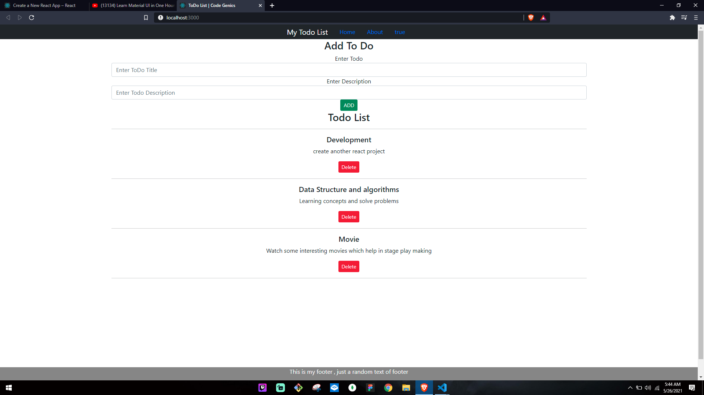

# Todo App



### Some of the app features :
* Adding Todo
* Delete Todo

# Tech Stack :
 
 

 
 

# How to use

check it is working 
[Here](http://todo-app-omraj.netlify.app)
<br> <br>
To use this app. first open up powershell or terminal.

**1.** Clone this project.
   ```
   git clone https://github.com/omrajsharma/todo-react-app
   ```

**2.** Navigate to the project directory.

    cd todo-react-app


**3.** Start the app.

    yarn start
    

